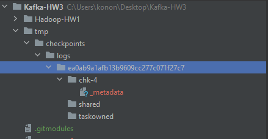
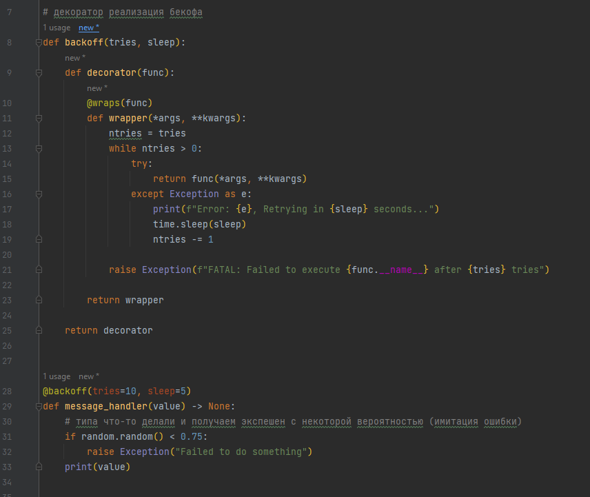

# Kafka-HW3
kafka+flink homework

### я прикрепил свое дз по хадупу в качестве сабмодуля, чтобы не пушить сюда то же самое 
#### (оттуда использовал композник для подъема хадупа)

# Блок 1 (Flink checkpoint )

Композ есть

Запуск прост:
```
# в одном терминале запускаем продюсера
python3 producer_1.py
```

```
# в другом терминале читаем из топика kononov
python3 consumer_1.py
```

```
# в третьем терминале читаем из топика kononov processed
python3 consumer_2.py
```

```
# в четвертом (xD) терминале запуск джобы флинка с чекпоинтом в локалдир
docker-compose exec jobmanager ./bin/flink run -py /opt/pyflink/device_job_localdir.py -d
# или с чекпоинтом в хадуп
docker-compose exec jobmanager ./bin/flink run -py /opt/pyflink/device_job_hadoop.py -d
```

```
# Топики надо предварительно создать
docker-compose exec kafka kafka-topics.sh --bootstrap-server kafka:9092 --create --topic kononov --partitions 1 --replication-factor 1
docker-compose exec kafka kafka-topics.sh --bootstrap-server kafka:9092 --create --topic kononov_processed --partitions 1 --replication-factor 1
```

можно и в пайчарм просто запустить эти 3 файла

## директория localdir чекпоинт флинка



## директория hadoop чекпоинт флинка

Попытался, но не увенчалось успехом. <br>
Со стороны флинка все банально, надо заменить file:// на hdfs://, но заставить флинк достучаться до хадупа не удалось. <br>
Ошибки, мол класс для коннекта не найден. Неужто надо собирать джобменеджер на основе образа хадупа? <br>
(в докерфайл хадупа добавить еще и флинк) <br>
Хадуп кластер был поднят и активен, потыкался из юпитера как в 1й дз - все ок.

# Блок 2 (Flink Window)

консьюмер и продюсер запускаются аналогично 1 и 3му блокам

### TumblingEventTimeWindows

```
docker-compose exec jobmanager ./bin/flink run -py /opt/pyflink/device_job_tumbling.py -d
```

### SlidingEventTimeWindows

```
docker-compose exec jobmanager ./bin/flink run -py /opt/pyflink/device_job_sliding.py -d
```

### EventTimeSessionWindows

```
docker-compose exec jobmanager ./bin/flink run -py /opt/pyflink/device_job_session.py -d
```

# Блок 3 (Kafka backoff)

Код в consumer_3_backoff.py

Запуск прост:
```
# в одном терминале
python3 producer_1.py
```

```
# в другом терминале
python3 consumer_3_backoff.py
```

можно и в пайчарм просто запустить эти 2 файла

Приложу скрин кода сюда, всяко удобнее, чем вам лазить по файлам:
